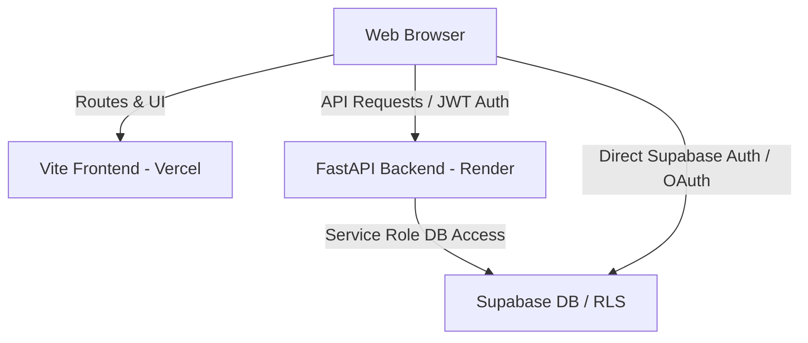

# 🚀 SkillForge Production Deployment Guide

This guide details the step-by-step instructions for deploying the **SkillForge** full-stack AI platform to production. 

The architecture is configured for zero-downtime, automated deployments using **GitHub Actions CI/CD** (defined in [`.github/workflows/deploy.yml`](./.github/workflows/deploy.yml)):
* **FastAPI Backend API**: Hosted on **Render** (via Docker or Python native service).
* **React/Vite Frontend**: Hosted on **Vercel** (with native SPA rewrites and secure headers).
* **Database & Auth**: Hosted on **Supabase** (Postgres + Supabase Auth).

---

## 🗺️ Deployment Architecture Map

---

## 📋 Step-by-Step Deployment Pipeline

### Step 1: Initialize Database & RLS (Supabase)
Ensure your production Supabase tables are ready:
1. Log in to your [Supabase Dashboard](https://supabase.com).
2. Execute [`database/schema.sql`](./database/schema.sql) using the SQL editor.
3. Execute [`database/policies.sql`](./database/policies.sql) to set up Row-Level Security (RLS) tables and grants for `authenticated` and `anon` roles.

---

### Step 2: Deploy the Backend API (Render)
Render hosts the FastAPI backend inside a high-performance environment using our provided **[`backend/Dockerfile`](./backend/Dockerfile)**.

1. Go to [Render](https://render.com) and log in.
2. Click **New +** and select **Web Service**.
3. Connect your GitHub repository `skillforge2`.
4. Configure the Web Service settings:
   * **Name**: `skillforge-backend`
   * **Region**: Choose closest to your users.
   * **Branch**: `main`
   * **Root Directory**: `backend` (⚠️ *Crucial: Point to the backend sub-folder*)
   * **Runtime**: `Docker`
5. Click **Advanced** and add the following **Environment Variables**:
   | Variable | Value / Source | Description |
   | :--- | :--- | :--- |
   | `SUPABASE_URL` | From Supabase API Settings | Your production Supabase Endpoint |
   | `SUPABASE_SERVICE_ROLE_KEY` | From Supabase API Settings (Secret) | Production Service Role Token |
   | `SUPABASE_ANON_KEY` | From Supabase API Settings | Production Anonymous Key |
   | `JWT_SECRET` | Generate a secure 32-character string | Token verification key |
   | `GITHUB_TOKEN` | Optional Personal Access Token | Prevents GitHub API rate-limiting |
   | `DEBUG` | `false` | Disables verbose debug logging |
6. Click **Create Web Service**. Render will automatically build the Docker image and deploy the FastAPI container.
7. **Copy your Render Web Service URL** (e.g., `https://skillforge-backend.onrender.com`).

---

### Step 3: Deploy the Frontend (Vercel)
Vercel hosts the React SPA statically, optimized with global edge networks and automated custom security headers defined in **[`frontend/vercel.json`](./frontend/vercel.json)**.

1. Log in to [Vercel](https://vercel.com).
2. Click **Add New** and select **Project**.
3. Import your `skillforge2` GitHub repository.
4. Configure the Framework and Build Directories:
   * **Framework Preset**: `Vite`
   * **Root Directory**: `frontend` (⚠️ *Crucial: Point to the frontend sub-folder*)
5. Expand **Environment Variables** and add:
   | Variable | Value | Description |
   | :--- | :--- | :--- |
   | `VITE_SUPABASE_URL` | Your production Supabase Endpoint | Connects frontend SDK to Supabase |
   | `VITE_SUPABASE_ANON_KEY` | Your production Supabase Anon Key | Connects frontend SDK to Supabase |
   | `VITE_API_URL` | `https://your-backend.onrender.com` | **Paste your Render Web Service URL here** |
6. Click **Deploy**. Vercel will compile the Vite assets and launch your site.
7. **Copy your production Vercel site URL** (e.g., `https://skillforge.vercel.app`).

---

### Step 4: Configure Supabase Redirect URIs
To allow users to log in securely via GitHub or email verification in production, you must whitelist your Vercel URL in Supabase:

1. In the [Supabase Console](https://supabase.com), go to **Authentication** > **URL Configuration**.
2. Update the **Site URL** to:
   * `https://your-app.vercel.app/` (Your Vercel production URL)
3. Under **Redirect URLs**, add:
   * `https://your-app.vercel.app/auth/callback`
   * `http://localhost:3000/auth/callback` (keeps local development functional!)

---

### Step 5: Enable Full Automation via GitHub Actions (CI/CD)
To enable automatic deployments every time you run `git push origin main`, configure your GitHub secrets:

1. Go to your GitHub Repository `Guru-CodesAI/skillforge2`.
2. Click **Settings** > **Secrets and Variables** > **Actions** > **New repository secret**.
3. Create the following secrets:
   * **Vercel Credentials** (For frontend CI/CD):
     * `VERCEL_TOKEN`: Your Vercel Personal Access Token (from Vercel Account Settings > Tokens).
     * `VERCEL_ORG_ID`: Your Vercel Organization ID (found in `~/.vercel/project.json` or your Team dashboard).
     * `VERCEL_PROJECT_ID`: Your Vercel Project ID (found in your Vercel project settings).
   * **Render Credentials** (For backend CI/CD):
     * `RENDER_API_KEY`: Your Render API Key (from Render Account Settings > API Keys).
     * `RENDER_SERVICE_ID`: Your Render Backend Web Service ID (found in your Render Service settings URL or header).

---

## 🔒 Post-Deployment Checklist

* [ ] **Verify SSL/TLS**: Test that both Vercel (`https://`) and Render (`https://`) endpoints resolve securely.
* [ ] **CORS Verification**: Visit the production Vercel URL, open the developer console, and confirm there are no CORS warnings when performing operations.
* [ ] **Database RLS Verification**: Confirm that unauthenticated requests to `/api/dashboard/stats` fail with a `401 Unauthorized` block.
* [ ] **Onboarding & Trust Score Flow**: Register a new user in production, complete onboarding, and verify that the calculated GitHub Trust Score renders flawlessly on the developer profile!
